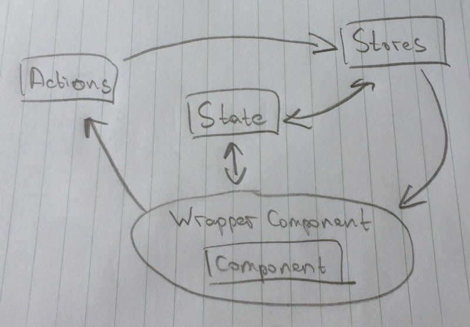

## Reactive future

What we love about React is how simple and enjoyable its declarative way of constructing components. And when [GraphQL](http://facebook.github.io/graphql/) was introduced our minds were blown because we realized: we can do the same with **data**, describing **what** our components need and not caring about **how** and **when** it will be delivered.

Also, Netflix [introduced](https://www.youtube.com/watch?v=hOE6nVVr14c) JSONGraph and Falcor this May. What’s interesting here is that working completely independent from Facebook they came up with very similar ideas. So, basically we can see a solid trend here.

## REST present

There is one frustrating thing about GraphQL/Falcor though: both of them require certain backend implementation and since we need to get stuff done on *existing APIs* in our company, we decided to go small steps to the amazing declarative data future.

So what do we have: a bunch of services with REST API, React, very simple Flux implementation and [Baobab](https://github.com/Yomguithereal/baobab) as *the* *data backbone* holding the entire immutable state of our application. I’m not gonna give too much attention to Baobab itself, only that we chose it over Immutable.js at the time because of it’s simplicity and explicitness. Also the maintainer **Guillaume** is very nice and responsive.

Enough with the intro, let’s jump into the actual code.

### Global immutable state

We keep all the data that should be outside components local state in one big global immutable tree which we call just “state”. We use it both in stores to put data inside different parts of the big tree, and in components to consume and use this data.

To illustrate this, let’s say we have an app that shows a list of products that can be sorted ascending or descending. By clicking on each of these products we can see its description.

Here is the structure of our global state:

```typescript
// selected product id
[ 'ui', 'products', 'selected' ]: <number>

// products lists with different sort
[ 'data', 'products', 'list' ]: Array<object>

// product info
[ 'data', 'products', 'details', productID ]: <object>
```

1. On the first level we have **data** and **ui** layers to *separate concerns* and make easier reasoning about the app state.
- **ui** layer usually holds the visual state that can be shared between different components and can be tracked if you have [history](https://github.com/Yomguithereal/baobab#history) in your application.
*Example*: data about dragging element, selected item in the list.
- in **data** layer we store something we either create ourselves or, which is a more common case, receive from the server.
*Example:* products list, user information.

1. On the second level there is **data type**, usually reflecting actions-stores pairs. In this simple example there is only *“products”*, but in the real apps you can see something like *“users”*, *“widgets”*, *“settings”*, etc. — you get the picture.

1. Finally, from the third level and deeper we can go bananas and create whatever data paths we want, there are no restrictions.

### Data Watcher

Here is how we work with data in components *(please read the comments)*:

```javascript
import { Component } from 'react';
import DataWatcher from 'components/@data-watcher';

// DataWatcher decorator watches data paths described below
// and updates local state whenever global state changes something in these paths
@DataWatcher
class Product extends Component {
  static displayName = 'Product';
  
  // data paths can be static or they can contain props and states
  // this gives us lots of flexibility
  static data = (props, state) => ({
    details: [
      'data',
      'products',
      'details',
      props._productID
    ]
  });

  // since data paths can contain props or state
  // DataWatcher must be reloaded on every update to make sure we have the relevant data
  componentWillReceiveProps(nextProps) {
    if (nextProps._productID !== this.props._productID) {
      this._reloadData(nextProps);
    }
  }

  // since data is just in local state of the component
  // we can work with it and not care about when and from where it will be delivered
  render() {
    const details = this.state.data.details;

    if (!details) {
      return null;
    }

    return (
      <div className='product'>
        {
          Object.keys(details).map(key => (
            <div className='product__property' key={ key }>
              { details[key] }
            </div>
          ))
        }
      </div>
    )
  }
};

export default Product;
```

So all these data dependencies described in components are actually cursor paths (cursors are awesome, read about them [here](https://github.com/Yomguithereal/baobab#cursors)). And what we can do with these cursors is track whenever something updates there and then put it into the components local state. That’s pretty much all DataWatcher does!

Another a bit more complex example is products list. Since we have “sort” option, and products list can be very long, we let server do the sorting and locally store different lists for each sort type *(please read the comments)*:

```javascript
import React, { Component } from 'react';
import DataWatcher from 'components/@data-watcher';

const sortTypes = [ 'asc', 'desc' ];

@DataWatcher
class ProductsList extends Component {
  static displayName = 'ProductsList';
  static data = (props, state) => ({
    // in data dependency besides cursor path
    // we can even specify certain properties like this
    products: [
      'data',
      'products',
      'list',
      {
        sort_type: state.sortType
      }
    ],
    
    // this is the case when we need to store ui state outside the component
    selectedProductID: [
      'ui',
      'products',
      'selected'
    ]
  });

  constructor(props) {
    super(props);

    this.state = {
      sortType: sortTypes[0]
    };
  }

  // one of the data dependencies relies on state
  // so we should reload data when state changes
  _changeSort(e) {
    this.setState({
      sortType: e.target.checked ? sortTypes[1] : sortTypes[0]
    }, this._reloadData);
  }

  // we have access to the cursors of data dependencies
  // so we can actually change them right in the components
  _chooseProduct(productID) {
    this.cursors.selectedProductID.set(productID);
  }

  render() {
    const data = this.state.data.products;

    if (!data) {
      return (<div>{ 'loading...' }</div>);
    }

    return (
      <div className='products-list'>
        <div className='products-list__sort'>
          { 'sort:' }
          <label>
            <input id='sort' type='checkbox'
              checked={ this.state.sortType === sortTypes[1] }
              onChange={ ::this._changeSort } />
            { this.state.sortType }
          </label>
        </div>
        <ul>
          {
            data.items.map(product => (
              <li key={ product.id }>
                <a href={ '#' + product.id } className='products-list__item'
                  onClick={ this._chooseProduct.bind(this, product.id) }>
                  { product.name }
                </a>
              </li>
            ))
          }
        </ul>
      </div>
    );
  }
}

export default ProductsList;
```

### Talking to the server

There is one missing part though: how do we request this data from the server? We didn’t want to do it from components, so here is what we came up with: with immutable data tree you can not only listen for the data updates, but even when someone trying to access data at the certain cursor path. So we just listen for ‘get’-ters in main wrapper component and if data is not in the state yet, we fire an action to get it. Take a look at the example *(please read the comments)*:

`app.js`:

```javascript
import { Component } from 'react';

// Flux action creators for products
import ProductsActions from 'actions/products';

// global state
import state from 'state';

// main wrapper component
class App extends Component {
  static displayName = 'app';

  constructor(props) {
    super(props);

    // whenever someone is trying to access data in these paths and it is not found
    // we are requesting this missing data from the server
    state.on('get',
      [ 'data', 'products', 'details' ],
      productID => ProductsActions.getProductInfo(productID)
    );
    
    state.on('get',
      [ 'data', 'products', 'list' ],
      sortOptions => ProductsActions.getProducts(sortOptions)
    );
  }

  render() {
    return (
      <div className='app'>
        ...
      </div>
    );
  }
}

export default App;
```

`actions.js`:

```javascript
import Actions from '.';

// when data has been loaded from the server, we dispatch it as usual
class ProductsActions extends Actions {
  dispatchProductInfoData(productID, data) {
    this.dispatch('PRODUCT_INFO_LOADED', { productID, data });
  }

  dispatchProductInfoDataLoadError(productID, error) {
    this.dispatch('PRODUCT_INFO_LOAD_ERROR', { productID, error });
  }

  getProductInfo(productID) {
    this.api.getProductInfo(productID).then(
      this.dispatchProductInfoData.bind(this, productID),
      this.dispatchProductInfoDataLoadError.bind(this, productID)
    );
  }
}

export default new ProductsActions();
```

`store.js`:

```javascript
import state from 'state';
import Store from '.';
import constants from 'constants/actions';

// store puts data into the global state
class ProductsStore extends Store {
  [constants.PRODUCT_INFO_LOADED]({ data }) {
    state.getTree().set([ 'data', 'products', 'details', data.id ], data);
  }

  [constants.PRODUCT_INFO_LOAD_ERROR]({ productID, error }) {
    this.emit(constants.PRODUCT_INFO_LOAD_ERROR, productID, error);
  }
}

export default new ProductsStore();
```

Now we came full circle and all our components listening to this cursor path will receive the data thanks to DataWatcher decorator.

## Conclusion

Here is the awkward illustration of data flow described above:

*This is pretty much still the good old flux, except only we have state as a separate entity*

You can play with the example I used in the article here: [https://github.com/mistadikay/react-auto-fetching-example/](https://github.com/mistadikay/react-auto-fetching-example/)

I intentionally didn’t mention how we save, reset and send parts of global state back to the server, since it probably deserves another article.

So, we showed you how did we manage to simplify the way React components work with data. Though, I’m pretty sure it’s only an intermediate step to the much more awesome reactive and declarative future which is just a few steps away.

**UPDATE:** following the feedback on this article, we created separate tool for working with immutable state in React. It’s called **[doob](https://github.com/mistadikay/doob)**. Also, there is a [branch in the example repository](https://github.com/mistadikay/react-auto-fetching-example/tree/doob) using **doob**. Please keep in mind that it’s still WIP.
