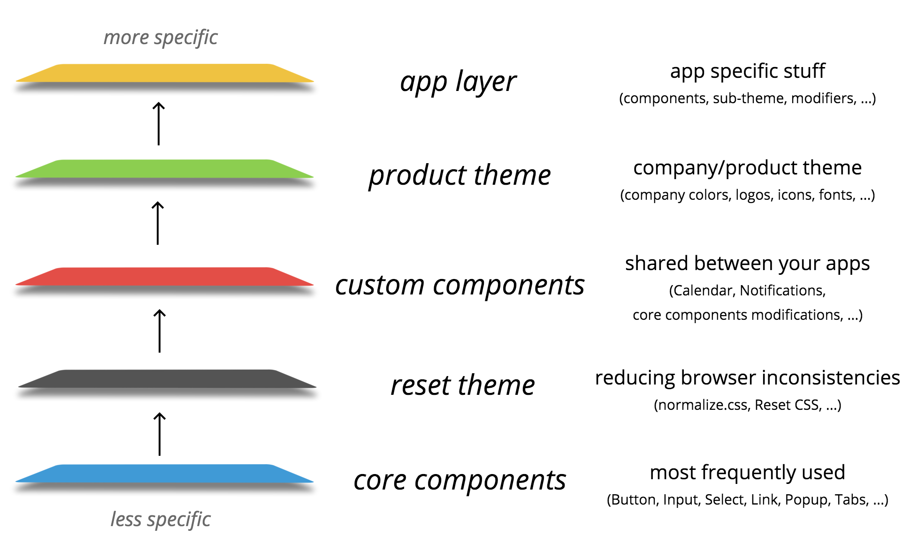
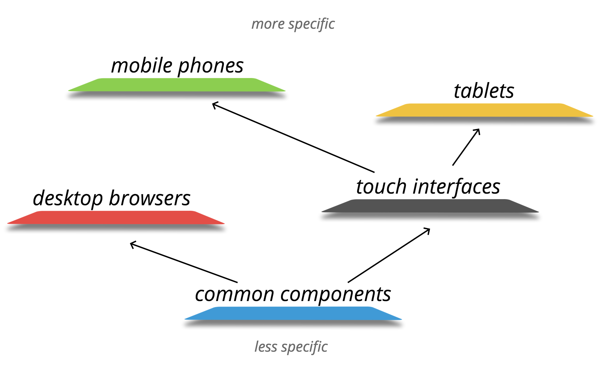
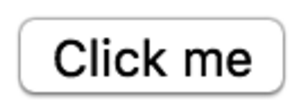
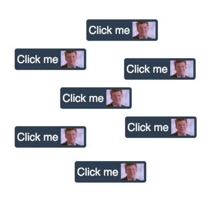

It’s been about a year since me and [Kir Belevich](https://github.com/deepsweet) started using React at [Lazada Group](http://www.lazada.com/) for some internal admin interfaces. We learned a lot during that time and our minds have been heavily shifted by that one-way data-flow philosophy React pushes.

Since React is not exactly a framework, but just a view library, we have both freedom of choice and a burden of responsibility, like: how to structure your application, how to manage its state or how to style your components. And styling was one of the first problems we were trying to address.

## Problems with styling

There are many issues with styling and they go far beyond React ecosystem, but there are two problems we wanted to resolve the most: naming inconsistency and style isolation.
> “There are only two hard problems in Computer Science: cache invalidation and naming things.” — Phil Karlton

That’s true. And often people don’t really bother. They name things half-randomly, as they want. In small projects it might not be that much of an issue, but when things get bigger, messy naming leads to readability and maintainability problems especially when you’re working in a team.

The same goes for the lack of style isolation in components: the more your application grows, the more there is a chance that things will go out of control and some unpredictable nasty side-effects might be introduced. Name collisions, unexpected style overwriting, *!important* and huge cascade chains, etc. — you know what I’m talking about.

[Inline styles](https://facebook.github.io/react/tips/inline-styles.html) were not exactly our piece of pie for [many](http://jamesknelson.com/why-you-shouldnt-style-with-javascript/) [reasons](http://keithjgrant.com/posts/against-css-in-js.html). [CSS-modules](https://github.com/css-modules/) were not yet invented back in Jan 2015, but even now we are not very happy with theming and a complete lack of cascade (which can be used to apply context-specific styles to the internal elements of a component). So, eventually we were left with the solution that already works for many people: naming convention, in particular, BEM.

## React ♥ BEM
> “BEM is a methodology, that makes your front-end code reusable, scalable, more strict and explicit.” — [getbem.com](http://getbem.com/)

### Flexible isolation

As you probably know, the idea of BEM is that you have a certain naming convention that helps you modularize your styles and isolate them while keeping flexibility and convenience of the good old CSS. Some people might argue that isolation is not exactly bulletproof, but from our experience and from the experience of some big companies like [Yandex](https://www.yandex.com/) (they built their [entire front-end stack](https://github.com/bem) around BEM methodology) it’s rarely the case in a real practice.

### Familiar abstractions

BEM’s *[block](https://en.bem.info/method/key-concepts/#block)* abstraction nicely compliments React’s *[component](https://facebook.github.io/react/docs/component-api.html)* in a way that it’s independent piece of UI with some incapsulated logic inside.

*[Element](https://en.bem.info/method/key-concepts/#element)*, *[modifier](https://en.bem.info/method/key-concepts/#modifier)* and *[mix](https://en.bem.info/method/key-concepts/#mix)* are also easy to read, understand and they are already familiar for a lot of people. So, thanks to BEM abstractions you don’t really have to think about naming too much, because you already have guidelines you can follow.

## Existing solutions

So how do you BEM in React?

Straightforward way:
```js
import React from 'react';

class Popup extends React.Component {
  render() {
    return (
      <div className={'popup' + (this.props.visible ? ' popup_visible' : '')}>
        <div className="popup__overlay"></div>
        <div className="popup__content">{this.props.children}</div>
      </div>
    );
  }
}
```

With some helpers:
```js
import React from 'react';
import b from 'b_';

const block = b.with('popup');

class Popup extends React.Component {
  render() {
    return (
      <div className={b({ visible: this.props.visible })}>
        <div className={b('overlay')}></div>
        <div className={b('content')}>{this.props.children}</div>
      </div>
    );
  }
}
```

There are lots of other things people use, but what we didn’t really like about all those solutions is that you still have to explicitly construct classNames with awkward helpers. Since we already have BEM abstractions — why not just use them directly?

### Yummies

So, at some point we really liked the idea of using [BEMJSON in React render](https://github.com/dfilatov/bem-react). We improved this idea a bit and created [Yummies](https://github.com/yummies/).

```js
import Yummies from '@yummies/yummies';

class Popup extends Yummies.Component {
  render() {
    return {
      block: 'popup',
      mods: {
        visible: this.props.visible
      },
      content: [
        {
          elem: 'overlay'
        },
        {
          elem: 'content',
          content: this.props.children
        }
      ]
    };
  }
}
```

Using normal js instead of ugly jsx was really appealing, also at that point of time we were really excited that we could do inheritance (ES6 classes + [modifying BEMJSON in render](https://github.com/yummies/core-components/blob/199f6a5793e61b7348dd7a121bb256581181b54c/components/button/index.js#L45-L65)). We shipped a couple of projects with this tool and it worked fine, but eventually we decided to dump this idea for two reasons.

**Patching React leads to maintainability hell.**

In order this whole BEMJSON thing to work we had to wrap React’s top-level API. It lead to maintainability problems and some minor performance issues. Also because we didn’t really use React directly, we had to wrap our components before working with external solutions like React Router which was not nice at all.

**Inheritance is not such a good idea.**

While inheritance might look really good at first sight (because [DRY](https://en.wikipedia.org/wiki/Don%27t_repeat_yourself) and stuff), it can create some maintainability problems as well. The more your codebase is growing, the harder it becomes to not to break anything and cause awful side-effects. And even if you’re trying to follow [semver](http://semver.org/), you will have to bump major versions with every tiny change of your components internals.

## Introducing reBEM

So, we’ve thought it through and simplified everything. A lot.

### [reBEM](https://github.com/rebem/)

reBEM is a set of independent decoupled packages for working with BEM in React ecosystem. Let’s start with [reBEM](https://github.com/rebem/rebem) package itself. This is how our popup from the previous examples looks like:

```js
import React from 'react';
import { BEM } from 'rebem';

class Popup extends React.Component {
  render() {
    return BEM(
      {
        block: 'popup',
        mods: { visible: this.props.visible }
      },
      BEM({ block: 'popup', elem: 'overlay' }),
      BEM({ block: 'popup', elem: 'content' }, this.props.children)
    );
  }
}
```

Notice that we don’t patch React, we just use a tiny helper ([you can almost put it in a tweet](https://github.com/rebem/rebem/blob/master/lib/index.js)) to create React elements. Also, as you can see, it’s a normal Javascript, which might be a deal breaker for people who are not so fond of JSX.

### [reBEM JSX](https://github.com/rebem/rebem-jsx)

But if you use and love JSX, we’ve got you covered too with [a small Babel plugin](https://github.com/rebem/rebem-jsx). The same popup in reBEM JSX:

```js
import React from 'react';

class Popup extends React.Component {
  render() {
    return (
      <div block="popup" mods={{visible: this.props.visible}}>
        <div block="popup" elem="overlay" />
        <div block="popup" elem="content">{this.props.children}</div>
      </div>
    );
  }
}
```

### [reBEM className helper](https://github.com/rebem/classname)

If you use external components you might want to *“BEMify”* them like this:

```js
import React from 'react';
import Modal from 'react-modal2';
import { stringify as b } from 'rebem-classname';

const block = 'popup';

class Popup extends React.Component {
  render() {
    return (
      <Modal
        backdropClassName={b({ block, elem: 'overlay' })}
        modalClassName={b({ block, mods: { visible: this.props.visible } })}>
        {this.props.children}
      </Modal>
    );
  }
}
```

Also the code above is a great example of how great functional composition works — no more unpredictable side-effects of inheritance. Existing Modal component is rendered inside Popup component and we’re working only with an external API, not knowing anything about Modal’s internals.

### reBEM [test-utils](https://github.com/rebem/test-utils) and [enzyme](https://github.com/rebem/enzyme) addons

While we completely abstracted away from className in render, we figured it would be great to have something like that in our unit-tests. We already used [Chai BEM assertions](https://github.com/mistadikay/chai-bem) for some time and we also created a couple of testing addons for [React Test Utils](https://facebook.github.io/react/docs/test-utils.html) and [Enzyme testing utility](http://airbnb.io/enzyme/) from Airbnb:

```js
import {
    renderIntoDocument,
    findRenderedDOMComponentWithBEM,
    isDOMComponent
} from 'rebem-test-utils';
import Popup from '../components/popup';

const tree = renderIntoDocument(<Popup />);
const overlay = findRenderedDOMComponentWithBEM(tree, { block: 'popup', elem: 'overlay' });

console.log(
    isDOMComponent(overlay)
);
// true
```

```js
import { shallow } from 'rebem-enzyme';
import Popup from '../components/popup';

const wrapper = shallow(<Popup />);

console.log(
    wrapper.findBEM({ block: 'popup', elem: 'content' }).length
);
// 1
```

### [reBEM CSS](https://github.com/rebem/css)

[Kir Belevich](https://github.com/deepsweet) had this great idea of abstracting away from classNames in CSS too, so reBEM PostCSS plugin was born. Take a look at the example:

```css
/* .popup */
:block(popup) {
  
  /* .popup_visible */
  &:mod(visible) {
    
  }
  
  /* .popup__content */
  &:elem(content) {
    
  }
  
  /* .popup__overlay */
  &:elem(overlay) {
    
  }
}
```

It’s an absolutely valid CSS, because these are just pseudo-elements, so highlighting in text editors and IDEs would not be broken. And you can use it in vanilla CSS or with any preprocessor.

## reBEM layers

There is also one interesting piece of BEM methodology which is often being missed out — it’s [BEM redifinition levels](https://en.bem.info/method/key-concepts/#redefinition-level). It’s a very powerful concept which we modified a bit and called **[reBEM layers](https://github.com/rebem/layers-loader)**.

With reBEM layers you can:

* share and compose the entire component libraries

* easily create themes

* concentrate on app functionality, not components

### Use cases

There are endless ways reBEM layers can be used and organized, so the example I’ll demonstrate you is just one of the many options. Here is an illustration for a better understanding.



_one of the most common use-cases for us_

<br><br>

1. The first layer in the bottom is **[core-components](https://github.com/rebem/core-components)** where we have all those form elements and basic components like popup and tabs — these are the components that will likely to be in ANY application or interface. We don’t have any styles in this theme, so it’s only about functionality and structure.

1. The next one is **[reset theme](https://github.com/rebem/theme-reset)** — often we need to reduce browser inconsistencies and give the same look for all html-elements on the page — so we can just apply this theme. Some people prefer resetting locally, that’s why it’s separated and not included in core-components by default. This theme contains only styles.

1. Now, **custom components**. This layer can contain a lot of specific to your company/product stuff — Calendars, Notifications, widgets, some modifications of core components, etc.

1. The next one is a **product theme** — themes like these usually contain 70% of styles and 30% of javascript (to modify core and custom components, for example adding an additional *Icon* element to *Button* or something).

1. And finally, we have an **application** layer with some specific components that are not shareable outside the app. So, now when most of the components are in the layers, you have a very short list of app components and you can concentrate on its functionality and domain-specific problems.

You might notice that we go from less specific layers that can be shared widely to the more specific where sharing is limited to some company’s product or not shareable at all like in the application layer.

Another example is *platform layers*. It’s pretty much self-explanatory:



### `#`

Components from layers are imported with a special **#**-character along with their styles. So instead of:

```js
import Button from '../../some-layer/button/';
import from '../../some-theme/button/styles.css';
import from '../../another-theme/button/styles.css';
```

you just write:

```js
import Button from '#button';
```

It imports **component** from the **nearest layer** and **styles** from **all layers**.

### Example: a history of one button

If it’s a bit confusing at this point, let’s clarify things by looking at the specific usage example: a good old button.

**1. core-components layer**

We’ll start at the **core-components** layer where components are as basic and simple as they can be. This is a button with a wrapper to be able to add children to it. Nothing fancy. Notice that we provide the ability to set mods and mix through props — it’s a good pattern allowing you to customize components from outside.

```js
/*
.
└── core-components/
    └── button/
        └── index.js
*/
export default function Button({ mods, mix, children, ...props }) {
  return (
    <label block="button" mods={mods} mix={mix}>
      <input block="button" elem="control" type="button" {...props} />
      {children}
    </label>
  );
}
```





**2. theme-reset layer**

Now, we reset styles for this button. In this layer, we have only styles, since we don’t need to add anything to the components logic.

```css
/*
.
└── theme-reset/
    └── button/
        └── styles.less
*/
.button {
  display: inline-block;
  box-sizing: border-box;

  &__control {
    box-sizing: border-box;
    background: none;
    appearance: none;
    outline: 0;
    border: 0;
    padding: 0;
    color: inherit;
    font: inherit;
    text-transform: none;
    line-height: normal;

    &::-moz-focus-inner {
      border: 0;
      padding: 0;
    }
  }
}
```





**3. custom-components layer**

Now we are in the layer where we store some custom components, and we want all buttons in our apps to be able to have an icon. Let’s do it by simply adding an optional Icon child if there is an icon prop.

```js
/*
.
└── custom-components/
    └── button
        └── index.js
*/
// js from the last layer, styles from all previous layers
import Button from '#button';
// import Button from 'core-components/button/index.js';
// import from 'theme-reset/styles.less';

export default class extends React.Component {
  renderIcon(icon) {
    if (icon) {
      return <span block="button" elem="icon" style={{ backgroundImage: icon }} />;
    }

    return null;
  },

  render() {
    return (
      <Button {...this.props}>
        {this.props.children}
        {this.renderIcon(this.props.icon)}
      </Button>
    );
  }
}
```

Note that we take all styles from the previous layers (only reset theme so far) and the Button from the last layer which is core components and then we use this button in our new component. This is the power of composition — see, we don’t CHANGE anything in a button from core-components, we just use it to create more complex button.





**4. product-theme layer**

Now to the product theme with our company colors, logos and icons and stuff. To be able to style our button, we add another element called mask to the existing children. And then we also add some styles to this element.

```js
/*
.
└── product-theme/
    └── button/
        ├── index.js
        └── styles.less
        
*/
// js from the last layer, styles from all previous layers
import Button from '#button';
// import Button from 'custom-components/button/index.js';
// import from 'theme-reset/styles.less';
// import from './styles.less';

export default function Button({ children, ...props }) {
    return (
      <Button {...props}>
        {children}
        <div block="button" elem="mask" />
      </Button>
    );
}
```

So now the Button from the previous layer is custom-components, but styles are imported not only from reset theme, but also from our current product-theme. Again, we don’t change anything in the original button, we just use it to create another component.





**5. using our button in app layer**

And finally we are in the application where we compose all the layers and add app layer where we can have some additional logic.

```js
/*
.
└── app/
    └── somewhere.js
*/
// js from the last layer, styles from all previous layers
import Button from '#button';
// import Button from 'product-theme/button/index.js';
// import from 'theme-reset/styles.less';
// import from 'product-theme/styles.less';

class SomeAppComponent extends React.Component {
  // ...
  return (
    //...
      <Button
        mix={{ block: 'my-app', elem: 'button' }}
        icon="never-gonna-give-you-up.png"
        onClick={doStuff}>
        {'Click me'}
      </Button>
    //...
  );
}
```

The same picture: Button is from the last layer (product theme) and styles from all previous themes. Rick and Roll!





### reBEM layers: webpack

So far we did implementation only for webpack, but theoretically it can be implemented for other module bundlers as well. Here is what [rebem-layers-loader](https://www.npmjs.com/package/rebem-layers-loader) config looks like:

```js
// ...
  preLoaders: [
    {
      test: /\.js$/,
      loader: 'rebem-layers',
      query: {
        layers: [
          // shared layers
          require('core-components'),
          require('theme-reset'),
          require('custom-components'),
          require('product-theme'),

          // app components
          {
            path: path.resolve('src/components/'),
            files: {
              main: 'index.js',
              styles: 'styles.less'
            }
          }
        ],
        // list of places where you will require components from layers
        consumers: [
          path.resolve('src/')
        ]
      }
    }
  ],
  // ...
```

You specify shared layers, your app local layer (with files you use in your components) and then any places where you plan to require components from your layers (app src or unit-tests directory).

More on how to configure and share your layers is in the [official documentation](https://github.com/rebem/layers-loader#usage).

## Conclusion

While some people use inline styles and css-modules, for others these solutions might not be suitable. So it’s nice to have a middle-ground alternative — easy to grasp and familiar, but in the same time successfully solving style isolation and naming inconsistency problems.

### Try it out

There is a [starter-kit](https://github.com/rebem/starter-kit) you can use to take a look at how different parts of reBEM work in a simple application. Also it can be a good starting point for your own projects.
