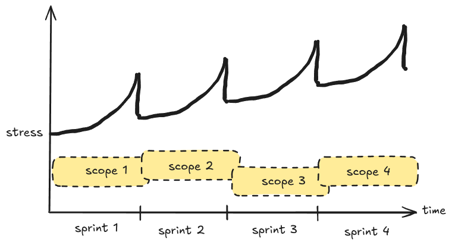
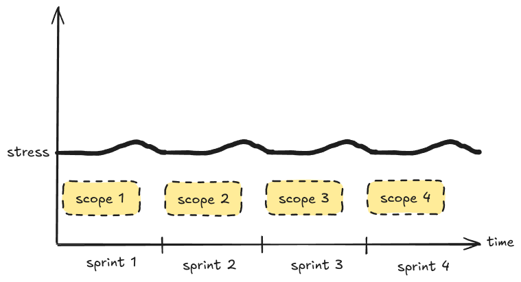
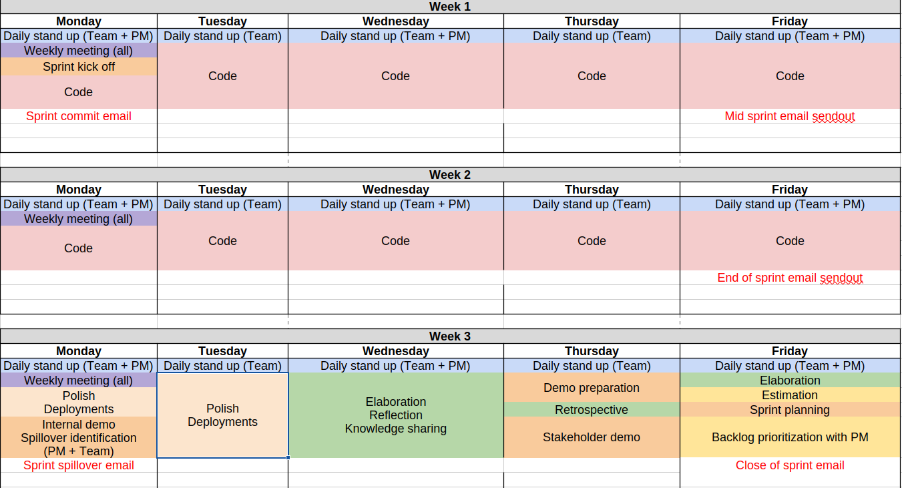

There exists a common dissatisfaction with Scrum's idea of delivering software in increments aka _sprints_. The author of [Why Scrum is Stressing You Out](https://rethinkingsoftware.substack.com/p/why-scrum-is-stressing-you-out), for example, argues that since sprints never stop and the pressure to deliver is always on, developers are becoming more and more stressed and don't have time to perform supporting activities like testing, bug fixing, documentation, and deployments.

## Why it happens

The main reason is: sprints are simply too full. I'm not talking about just over-committing, but the way people perceive the sprint schedule and how they _think_ they should fill it with tasks.

For example, a team might think:

> Our sprint consists of three weeks, therefore we are planning for three weeks of development. Meetings? We'll fit them somewhere in-between when we are not coding. Testing and deployments? Part of the tasks. Planning? Hopefully we'll have an hour on Friday before the next sprint starts.

I sympathize with this way of thinking: people just want to get more stuff done. In their head, the sprint looks like this (I'm borrowing the stress analogy from [Adam's article](https://rethinkingsoftware.substack.com/p/why-scrum-is-stressing-you-out)):

But what actually happens can often look like this:

Why? Because:
- tasks are getting rushed by the end of the sprint with little time for review, testing, and deployment
- the next sprint starts with "a ghost" of the previous one lingering around since some administrative tasks are still not done
- planning for the next sprint is rushed too, because again: lack of time
- reflection, analyzing, documentation, knowledge sharing? You guessed it: no time.

In the end:
- you don't get done as much as you think
- tech debt is increasing
- there is no confidence that every sprint delivers a sprint increment in the advertised time
- the team is stressed out, exhausted, and considering going back to the "good old waterfall"

## It's not agile

If you look at the Agile manifesto, this way of working potentially violates some core [Agile principles](https://www.agilealliance.org/agile101/12-principles-behind-the-agile-manifesto/), namely:

> **8.**  Agile processes promote sustainable development. The sponsors, developers, and users should be able to maintain a constant pace indefinitely.

If the team feels overwhelmed, how can they sustain that pace indefinitely?

> **12.** At regular intervals, the team reflects on how to become more effective, then tunes and adjusts its behavior accordingly.

If there is no time for reflection and re-evaluation, how can the team adjust and become more effective?

## What to do

Committing less would be an obvious and correct solution, but I think it's only one piece of the puzzle.

The most important adjustment is to change the mental model about the sprint schedule, namely: **stop treating it as continuous development time** and **leave space for supporting tasks**, reflection, and planning.

How can it look in practice:
- aim to be done with the bulk of development at around 70-75% of the  length of the sprint
- spend the rest of the sprint on:
  - quality code reviews
  - proper testing
  - deploying what wasn't deployed
  - elaboration and knowledge sharing with your team
  - reflecting on the results of your sprint, both with the team and stakeholders (internal and external demos for example)
  - planning the next sprint

By the end of those activities, your sprint should be done and **sealed**. The team can turn this page and look forward to the next one fully focused and committed.

It will occasionally happen that even after all this, there is still some time left. Then, of course, feel free to start tasks from the next sprint, but most importantly, don't put anything into the current one. It is **sealed**.

## My experience

When trying out this sprint schedule (proposed by my manager at the time), it felt wrong. It felt like a waste of time. But after a few sprints, it was obvious that we were sticking with it.

I then successfully applied the same approach as a Tech Lead in a project with tight deadlines and many unknowns — and again — it was great. The team had breathing room, there was little to no stress, and it allowed for a healthy project with a predictable delivery pace.

This is how a sprint schedule can look like, but it's just one of many variations (some teams have dedicated meeting days, for example):

## Conclusion

I specifically didn't go into why software should be delivered in increments: you can read it in the Agile Manifesto or any other sources, of which there are many.

What I want to emphasize is: go back periodically to **fundamentals**, **understand and internalize** why certain ways of working are recommended, and see if your team is **interpreting** them right.
